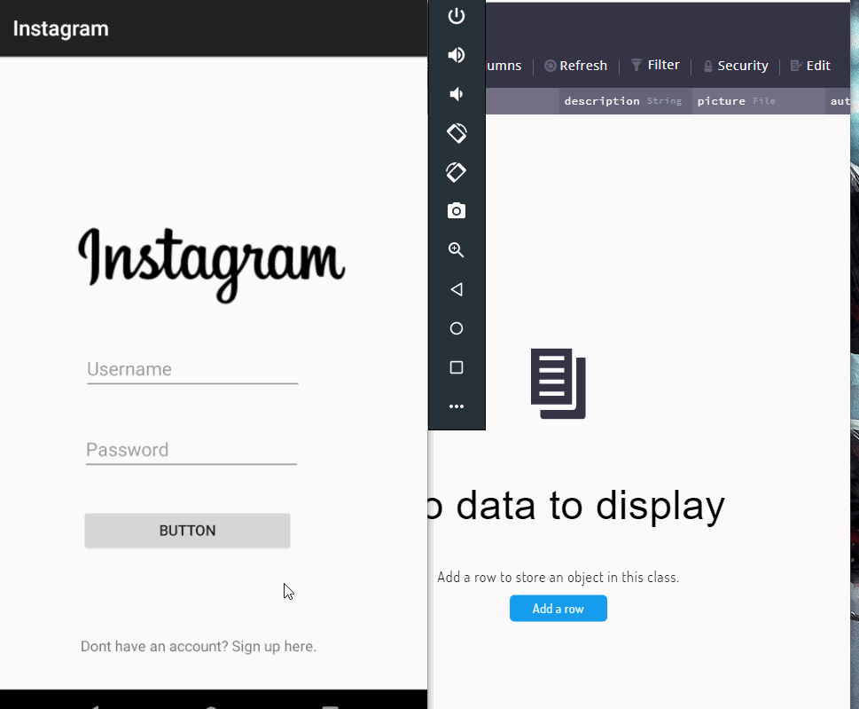

# Project 3 - *InstagramClone*

**InstagramClone** is a photo sharing app similar to Instagram but using Parse as its backend.

## User Stories

The following functionality is completed:

- [X] User can sign up to create a new account using Parse authentication.
- [X] User can log in and log out of his or her account.
- [X] The current signed in user is persisted across app restarts.
- [X] User can take a photo, add a caption, and post it to "Instagram".
- [X] User sees app icon in home screen and styled bottom navigation view
- [X] User can view the last 20 posts submitted to "Instagram".
- [X] User can pull to refresh the last 20 posts submitted to "Instagram".
- [X] The user should switch between different tabs - viewing all posts (feed view), capture (camera and photo gallery view) and profile tabs (posts made) using fragments and a Bottom Navigation View. 
- [X] Style the feed to look like the real Instagram feed.

## Video Walkthrough

Part 2 - Adding posts to feed:

Part 1 - Login/SignUp with Parse:

GIF created with [LiceCap](http://www.cockos.com/licecap/).

## Notes
- Learned how to create custom API calls and query data from server
- Implemented RecylerView and LinearLayout
- Utilized fragments and bottom navigation bar
- Used Views, Viewgroups and Layouts

## Open-source libraries used

- [Android Async HTTP](https://github.com/codepath/CPAsyncHttpClient) - Simple asynchronous HTTP requests with JSON parsing
- [Glide](https://github.com/bumptech/glide) - Image loading and caching library for Android

## License

    Copyright [2019] [Syed Sadman]

    Licensed under the Apache License, Version 2.0 (the "License");
    you may not use this file except in compliance with the License.
    You may obtain a copy of the License at

        http://www.apache.org/licenses/LICENSE-2.0

    Unless required by applicable law or agreed to in writing, software
    distributed under the License is distributed on an "AS IS" BASIS,
    WITHOUT WARRANTIES OR CONDITIONS OF ANY KIND, either express or implied.
    See the License for the specific language governing permissions and
    limitations under the License.
